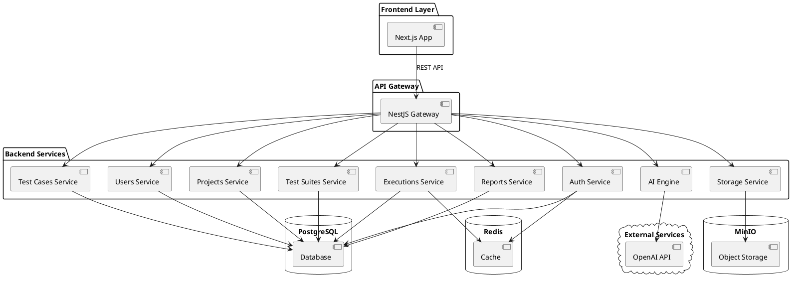
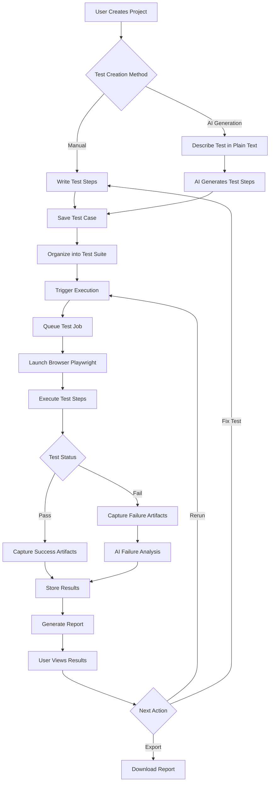

# Documentation Images

This directory contains visual assets for the platform documentation.

## Image Placeholders

The following images should be added to complete the documentation:

### 1. architecture-diagram.png
**Description**: High-level system architecture diagram showing the complete platform structure.

**Should Include:**
- Frontend layer (Next.js application)
- API Gateway layer (NestJS)
- Backend services (Auth, Users, Projects, Test Cases, Test Suites, Executions, Reports, AI Engine, Storage)
- Database layer (PostgreSQL)
- Cache layer (Redis)
- Object storage (MinIO)
- External integrations (OpenAI API)
- Data flow arrows between components
- Communication protocols (REST, WebSocket)

**Suggested Format**: PNG with transparent background, minimum 1200x800 pixels

**Tools to Create**:
- draw.io (https://app.diagrams.net/)
- Lucidchart (https://www.lucidchart.com/)
- Excalidraw (https://excalidraw.com/)
- PlantUML (https://plantuml.com/)

**Example PlantUML Code**:


---

### 2. dashboard-screenshot.png
**Description**: Screenshot of the main dashboard interface showing the user interface.

**Should Include:**
- Navigation sidebar with menu items
- Top navigation bar with user profile
- Main content area showing dashboard widgets
- Test execution statistics
- Recent test runs
- Project overview
- Quick action buttons

**Suggested Format**: PNG, minimum 1920x1080 pixels (full HD)

**Capture Guidelines**:
1. Use a clean test environment with sample data
2. Ensure no sensitive information is visible
3. Show the interface in a professional state (no debug overlays)
4. Use light mode for better visibility
5. Capture in Chrome/Firefox at 100% zoom
6. Include both collapsed and expanded sidebar views

**Key Areas to Highlight**:
- Project selector dropdown
- Test execution status indicators
- Chart/graph visualizations
- Recent activity feed
- Navigation menu structure

---

### 3. workflow-diagram.png
**Description**: End-to-end workflow diagram showing the test creation, execution, and reporting process.

**Should Include:**

**Phase 1: Test Creation**
- User creates project
- User writes test case manually OR uses AI generation
- Test case is saved to database
- Test case is organized into test suites

**Phase 2: Test Execution**
- User triggers test execution
- Execution service queues the test
- Playwright launches browsers
- Test steps are executed
- Screenshots/videos are captured
- Results are stored

**Phase 3: Result Analysis**
- Execution completes
- AI analyzes failures (if any)
- Report is generated
- User views results
- User exports report

**Suggested Format**: PNG with transparent background, minimum 1400x900 pixels

**Flow Direction**: Left to right or top to bottom

**Tools to Create**:
- draw.io
- Mermaid (https://mermaid.js.org/)
- Figma (https://www.figma.com/)

**Example Mermaid Code**:


---

## How to Add Images

1. **Create the images** using the tools and guidelines above
2. **Name them exactly** as specified (architecture-diagram.png, dashboard-screenshot.png, workflow-diagram.png)
3. **Place them in this directory** (/docs/images/)
4. **Commit them to git**:
   ```bash
   git add docs/images/architecture-diagram.png
   git add docs/images/dashboard-screenshot.png
   git add docs/images/workflow-diagram.png
   git commit -m "docs: Add documentation images"
   git push
   ```

## Image Optimization

Before committing images, optimize them to reduce file size:

**Using ImageOptim (macOS):**
```bash
imageoptim docs/images/*.png
```

**Using OptiPNG (Linux/macOS):**
```bash
optipng -o7 docs/images/*.png
```

**Using TinyPNG (Web):**
Visit https://tinypng.com/ and upload your images

## Using Images in Documentation

Once images are added, reference them in documentation using:

```markdown

```

or for more control:

```html

```

## Image Guidelines

- **Format**: PNG preferred for diagrams, JPG for screenshots
- **Size**: Optimize for web (target < 500KB per image)
- **Resolution**: Minimum 72 DPI for web, 300 DPI for print
- **Accessibility**: Always include descriptive alt text
- **Consistency**: Use consistent colors and styling across diagrams
- **Updates**: Update images when the UI or architecture changes significantly

## Color Palette Suggestions

For consistency in diagrams, consider using:

- **Primary Blue**: #0066CC (headers, primary elements)
- **Success Green**: #28A745 (passed tests, success states)
- **Error Red**: #DC3545 (failed tests, errors)
- **Warning Yellow**: #FFC107 (warnings, pending states)
- **Neutral Gray**: #6C757D (borders, secondary text)
- **Background**: #F8F9FA (light background)
- **Dark**: #212529 (text, dark elements)

## Diagram Conventions

- Use **solid arrows** for synchronous operations
- Use **dashed arrows** for asynchronous operations
- Use **bold borders** for primary components
- Use **thin borders** for secondary components
- Group related components with **colored backgrounds**
- Add **labels** to all arrows indicating the operation/data flow

---

**Status**: Placeholder descriptions created. Images to be added.

**Last Updated**: January 2024
